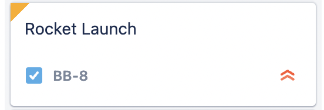

# userscript-jira-dependency-indicators

This userscript will add dependecy indicator to jira board cards.

Colored card corners indicates `is blocked by` links to **unresolved** issues.
* 🟨 `yellow` corners indecates a project **internal** dependecy
* 🟥 `red` &emsp;&nbsp; corners indecates a project **external** dependecy

#### Screenshot

## Install
* Install [Tampermonkey](https://www.tampermonkey.net/) or any other userscript manager
* Install userscript [jira-dependency-indicators](https://github.com/qoomon/userscript-jira-dependency-indicators/raw/main/jira-dependency-indicators.user.js)
